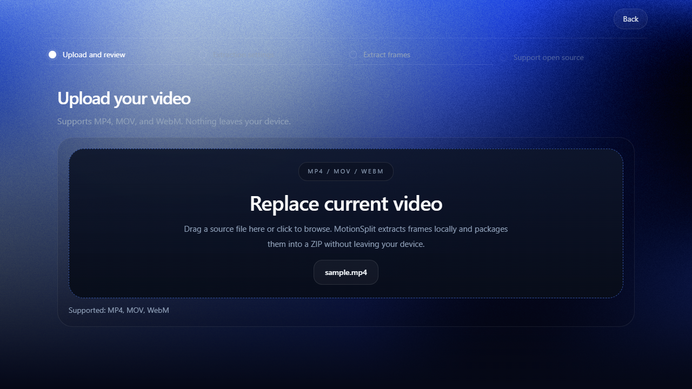
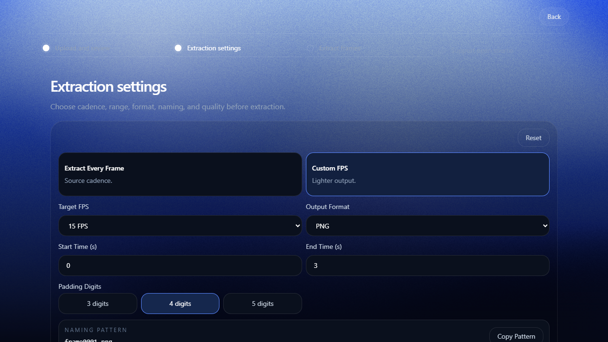
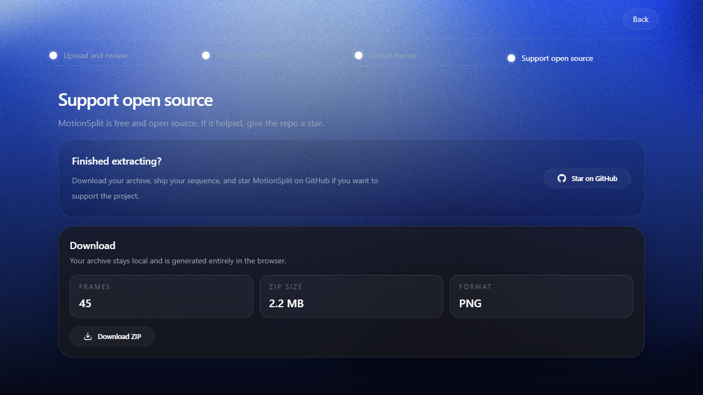

<p align="center">
  
</p>

<h1 align="center">MotionSplit</h1>

<p align="center">
  <strong>Turn video into frame sequences, entirely in your browser.</strong>
</p>

<p align="center">
  Extract every frame or sample at a chosen FPS, then download the result as a ZIP.<br />
  No uploads. No account. No backend.
</p>

## What is MotionSplit?

MotionSplit is a free, open-source video frame extractor for developers, animators, designers, and anyone who needs still images from a clip.

Choose a video, control exactly which frames are produced, and download the complete sequence as PNG or JPG files. Processing happens locally with `ffmpeg.wasm`, so your source video never leaves your device.

## From video to ZIP

### 1. Drop your video

Choose an MP4, MOV, or WebM file from your device. MotionSplit reads it directly in the browser without uploading it anywhere.



### 2. Choose the extraction settings

Extract every source frame or choose a custom FPS. You can also set the time range, image format, JPG quality, filename padding, and naming pattern.



### 3. Download one ZIP

MotionSplit extracts the frames locally, shows the result, and packages the complete sequence into a single ZIP file.



## What you control

- Every source frame or a custom FPS cadence
- Start and end time
- PNG or JPG output
- JPG quality
- Three, four, or five filename padding digits
- Frame naming pattern
- Local ZIP download

## Private by design

```text
Your video  ->  Your browser  ->  Your ZIP
                  ffmpeg.wasm
```

- **No uploads:** the source file stays on your device.
- **No servers:** extraction and ZIP creation happen in the browser.
- **No accounts:** open the tool and use it.
- **No tracking:** MotionSplit does not collect or store usage data.

## Supported input and limits

| | Limit |
| --- | --- |
| Input formats | MP4, MOV, WebM |
| Maximum video length | 10 minutes |
| Maximum file size | 1 GB |
| Recommended working range | Under 6 minutes and 500 MB |

Large clips take longer and use more browser memory. The recommended range gives the fastest and most reliable local turnaround.

## Run locally

```bash
git clone https://github.com/abhijeetkakade1234/MotionSplit.git
cd MotionSplit
npm install
npm run dev
```

Production checks:

```bash
npm run lint
npm run build
```

## Built with

- React, TypeScript, Vite, and Tailwind CSS
- `ffmpeg.wasm` for local video processing
- JSZip for local archive creation
- Framer Motion and GSAP for interface motion
- Vite PWA for installable and offline use

## Open source

MotionSplit is free to use, fork, and improve under the [MIT License](LICENSE).

Built by [Abhijeet Kakade](https://abhijeetkakade.in/).
